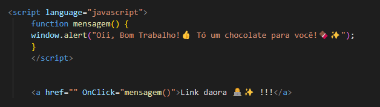
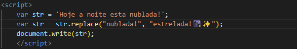

# Aprendendo alguns código em JavaScript ✨

## Simples função de alerta 

Esse código tem a função que ao clicar no link disponível na página, ele abre uma pop-up de alerta. Fiquei agora com a explicaçõ de algumas funções utilizadas:

* Funcition: Uma fuction é um procedimento de JavaScript - um conjunto de instruções que executa uma tarefa ou calcula um valor.

* Window.alert: O método Window. alert() mostra uma caixa de diálogo de aviso com o conteúdo opcionalmente especificado e um botão OK.

* OnClick: O método onclick executará uma função sempre que o elemento que estiver associado a ele for clicado.

## Substituir palavra numa string

Esse código realiza um comando que substitui uma determinada palavra da frase apresentada inicialmente no código. Agora veja a explicação de alguns comandos:

* Document. write: É uma função do javascript que escreve no html da página. Basicamente, ele pega uma página e sobrescreve seu conteúdo, o document. write é o mais utilizado para fazer a apresentação de texto dentro das tags scripts.

* Str.replace:  O método replace() retorna uma nova string com algumas ou todas as correspondências de um padrão substituídas por um determinado caractere (ou caracteres).

